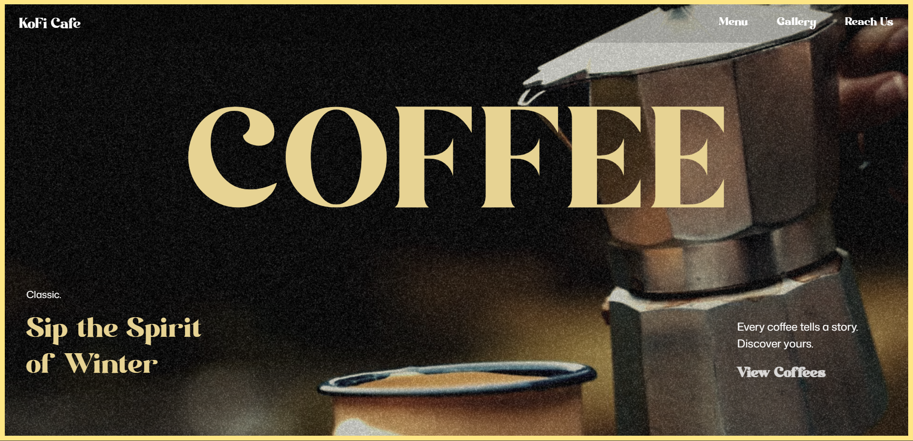

# Coffee Landing Page ☕️

A visually rich, coffee-themed landing page for a cafe website, built with **React**, **Vite**, and **GSAP** for smooth, interactive animations.

## ✨ Features

- **Animated Hero Section:** Video background plays on scroll trigger for immersive experience.
- **GSAP Animations:** Engaging transitions and effects throughout the page.
- **Unique Design:** Noisy/grainy textures and a warm, coffee-inspired palette.
- **Responsive Layout:** Looks great on all devices.

## 🚀 Tech Stack

- [React](https://react.dev/)
- [Vite](https://vitejs.dev/)
- [GSAP](https://gsap.com/)
- [TailwindCSS](https://tailwindcss.com/)

## 📸 Preview



## 🛠️ Getting Started

```bash
git clone https://github.com/msanchariii/cafe.git
cd coffee-landing-page
npm install
npm run dev
```

Open [http://localhost:5173](http://localhost:5173) to view it in your browser.

## 📂 Project Structure

```
src/
    components/
    assets/
    App.jsx
    main.jsx
```
